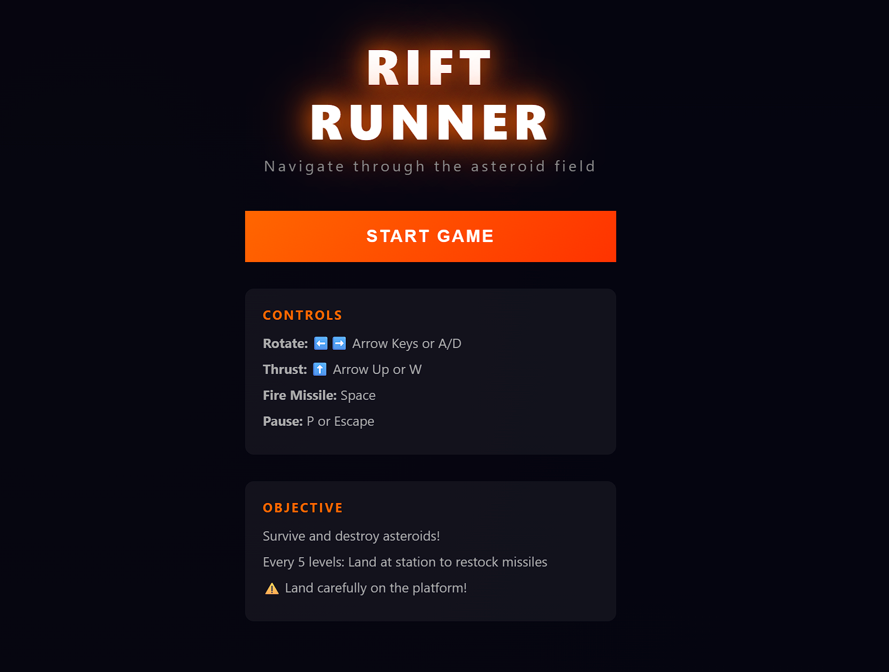
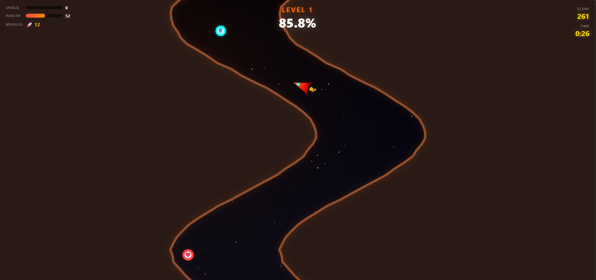

# Rift Runner

**Rift Runner** is a fast-paced, browser-based arcade game where you pilot a rocket through a procedurally generated rift that narrows with each level. Dodge the walls, manage shield and hull integrity, collect power-ups, and survive escalating hazards as the tunnel shifts and tightens.

Built with pure **HTML5 Canvas + vanilla JavaScript + CSS** — **no frameworks, no dependencies**.

## 🔗 Live Demo

Play here: https://riftrunner.foldbyte.cz/

## 📸 Screenshot



---

## 🎮 Gameplay

- Your rocket starts near the bottom of the screen.
- The world scrolls downward to simulate forward flight.
- Two walls form a corridor (the “rift”) and it becomes narrower as levels progress.
- Colliding with walls drains **Shield** first, then **Health**.
- Pickups can restore Shield/Health and provide temporary boosts.
- From higher levels, hazards (e.g., asteroids) appear and increase in number.

### Level Progression
Levels are based on **distance traveled**:
- Each level completes after the screen scrolls **2× the screen height**.
- The UI shows **progress %** to the next level.

---

## 🕹️ Controls

### Desktop
- **A / D** or **← / →** : rotate / steer left-right  
- **W / ↑** : thrust  
- **P** or **Esc** : pause / resume
- **SPACE** : shoot

### Mobile
- Touch controls:
  - **Left side**: rotate left
  - **Right side**: rotate right
  - **Bottom-center**: thrust  
  - Multi-touch supported (thrust + rotate)

---

## 🧰 Tech Stack

- HTML5 Canvas
- Vanilla JavaScript
- CSS
- No external libraries

---

## 🚀 Running the game

### Option 1: Open directly (fastest)
1. Clone/download the repository
2. Open `index.html` in your browser

> Some browsers may restrict certain features when opening files directly (e.g., audio). If anything behaves oddly, use Option 2.

### Option 2: Run a local server (recommended)

#### Using Python
From the project folder:

```bash
python -m http.server 8000
```

Open:
- http://localhost:8000

#### Using Node.js (http-server)
```bash
npx http-server -p 8000
```

Open:
- http://localhost:8000

---

## 📁 Project Structure

```text
.
├── index.html      # Canvas + UI layout
├── style.css       # Styling
├── game.js         # Game logic (rendering, physics, collisions, levels)
├── screenshot.png  # Screenshot used in README
├── README.md
└── LICENSE
```

---

## ⚙️ Tuning & Customization

Most gameplay feel can be adjusted in `game.js`. Common knobs:
- Base scroll speed and difficulty scaling
- Rocket turn acceleration / max turn rate
- Shield/health values and collision damage
- Pickup spawn rates and effects
- Asteroid spawn rules per level

---

## 🤝 Contributing

PRs and issues are welcome. If you want to contribute:
1. Fork the repo
2. Create a feature branch
3. Submit a pull request with a clear description

---

## 📜 License

MIT License — see `LICENSE` for details.
